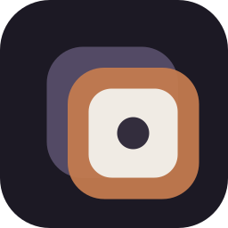

<div align="center">
  

  # Reunion

  **和过去的 AI 对话重逢**

  聚合本机 Cursor / Claude Code / Codex 会话的桌面 App（macOS / Windows）<br>
  跨 repo 检索、回看、标注、导出——让每一轮 AI 对话变成可复用的资产

  [](https://github.com/MeCKodo/reunion/releases/latest)
  [](https://github.com/MeCKodo/reunion/releases/latest)
  [](https://github.com/MeCKodo/reunion/releases/latest)

  [安装](#安装) · [功能](#功能) · [Changelog](./CHANGELOG.md)

</div>

---

## 为什么需要 Reunion

每天和 AI Agent 聊几十轮，聊完关掉窗口——那些 prompt、那些 trial-and-error、那些好不容易聊出来的最佳实践，**第二天就找不到了**。

更麻烦的是，三家 Agent 的对话散落在 `~/.cursor`、`~/.claude`、`~/.codex` 三个不同的角落，翻都没法翻。

Reunion 把这些散落的"对话宝藏"**重新聚到一起**——可搜、可读、可标、可一键导出成 `.cursor/rules/*.mdc` 或 `.claude/skills/*/SKILL.md`，让对话变成知识。

<!-- TODO: 补产品主界面截图 -->
<!--  -->

## 功能

<table>
  <tr>
    <td width="50%">

**聚合三家 Agent**

Cursor（旧 `.txt` + 新 `.jsonl`）、Claude Code、Codex CLI 的本地会话统一索引，按 repo 分组展示。

  </td>
    <td width="50%">

**全文检索 + 命中预览**

中英文关键词搜索，命中片段按角色高亮预览，支持会话内 `⌘F` 二次查找。

  </td>
  </tr>
  <tr>
    <td>

**Smart 导出**

一键把对话导出成 `.cursor/rules/*.mdc` 或 `.claude/skills/*/SKILL.md`，AI 自动生成结构化 Markdown，直接写入目标仓库。

  </td>
    <td>

**AI 自动打标签**

选定会话后 AI 从用户消息中提炼 1-3 个标签，批量处理，SSE 实时推送进度。只发送用户消息，助手回复留在本地。

  </td>
  </tr>
  <tr>
    <td>

**多维筛选**

来源 Tab / repo / 时间窗口（7-90 天）/ 星标 / 标签 / 工具桶（Read / Write / Exec / Agent）多维度过滤。

  </td>
    <td>

**双 AI Provider**

OpenAI ChatGPT 多账号 OAuth + Cursor Agent 单账号，token 不经手——OpenAI 走 codex 管理，Cursor 走系统密钥库（macOS Keychain / Windows Credential Manager）。

  </td>
  </tr>
</table>

## 安装

### macOS

一行命令，自动检测架构、下载 DMG、装到 `/Applications`、清 Gatekeeper：

```bash
curl -fsSL https://github.com/MeCKodo/reunion/releases/latest/download/install.sh | bash
```

> 首次手动安装 DMG 可能需要过一次 Gatekeeper，详见 [FIRST_OPEN.md](./FIRST_OPEN.md)。

卸载：

```bash
curl -fsSL https://github.com/MeCKodo/reunion/releases/latest/download/uninstall.sh | bash
```

### Windows

打开 PowerShell 跑这一行：

```powershell
iwr -useb https://github.com/MeCKodo/reunion/releases/latest/download/install.ps1 | iex
```

会自动检测 CPU 架构（x64 / arm64）、下载安装包、per-user 静默安装到 `%LOCALAPPDATA%\Programs\Reunion`，开始菜单与桌面快捷方式都会创建好。也可以下载 portable 版（无需安装）：`$env:REUNION_PORTABLE='1'; iwr ... | iex`。

> 因为没买 EV 签名证书，首次启动可能跳「Windows 已保护你的电脑」——点 **更多信息** → **仍要运行**。详见 [FIRST_OPEN_WINDOWS.md](./FIRST_OPEN_WINDOWS.md)。

卸载：

```powershell
iwr -useb https://github.com/MeCKodo/reunion/releases/latest/download/uninstall.ps1 | iex
```

## 支持的数据源

| Agent | 路径 | 格式 |
|-------|------|------|
| **Cursor** | `~/.cursor/projects/*/agent-transcripts` | `.txt` / `.jsonl` |
| **Claude Code** | `~/.claude/projects` | `.jsonl` |
| **Codex CLI** | `~/.codex/sessions` | `.jsonl` |

数据完全在本地读取，不上传任何对话内容到云端。

## 开发

```bash
fnm use 20
pnpm install
pnpm run serve   # http://127.0.0.1:9765
```

详细的架构说明、API 文档、打包发版流程见 [AGENTS.md](./AGENTS.md)。

## License

MIT
