# Reunion · 和过去的 AI 对话重逢

> **聚合本机 Cursor / Claude Code / Codex 的会话，让 AI 对话变成可复用的资产。**

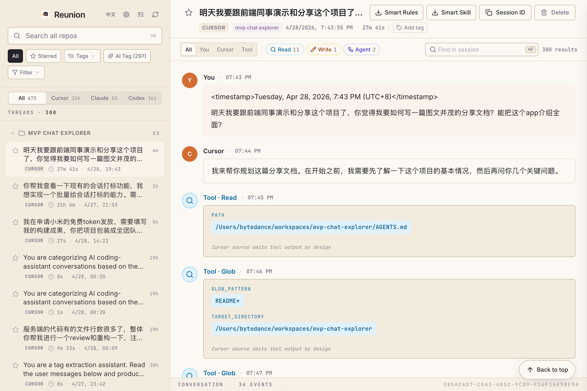

## 一句话介绍

Reunion 是一个 macOS 原生桌面 App，把你本机所有 AI Coding Agent 的对话**重新聚到一起**——可搜、可读、可标、可一键导出成 `.cursor/rules/*.mdc` 或 `.claude/skills/*/SKILL.md` 这样的可复用资产。

数据完全在本地，不上传任何对话内容到云端。

---

## 一、为什么需要 Reunion

> [!NOTE]
> 你是不是也有这样的体验：
>
> - 上周用 Cursor 调通了一个 SSR 的奇怪 bug，今天忘了怎么解的
> - Claude Code 帮你跑通的部署脚本，关掉窗口就找不到了
> - 想把"和 AI 调试 Webpack 的最佳实践"提炼成 `.cursorrules` 给团队，但找不到对话原文
> - 三家 Agent 的对话散在 `~/.cursor`、`~/.claude`、`~/.codex`，根本不知道去哪找

每天和 AI Agent 聊几十轮，聊完关掉窗口——那些 prompt、那些 trial-and-error、那些好不容易聊出来的最佳实践，第二天就找不到了。

Reunion 把这些散落的"对话宝藏"重新聚到一起，让它们不再被遗忘。

---

## 二、三分钟看懂核心场景

### 场景 A：跨 repo 检索老问题

在搜索框里随便输个关键词，Reunion 会同时扫描三家 Agent 的所有历史会话，按 repo 分组展示命中结果，每条会话下还有命中片段预览。

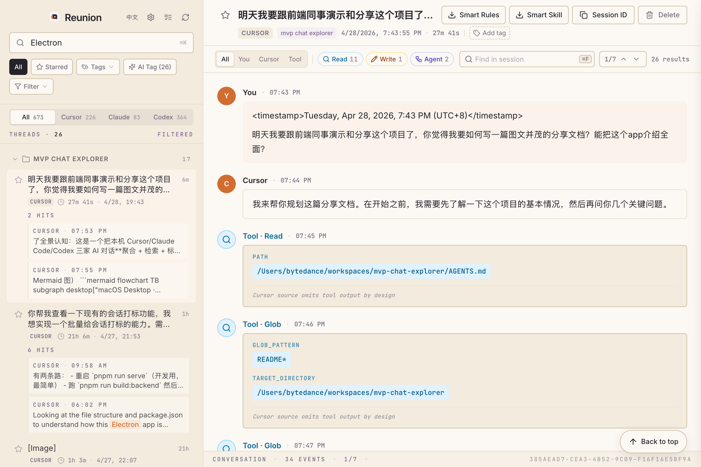

上图是搜索 "Electron" 的结果：左侧 sidebar 显示 **26 个会话命中**、按 repo 分组（MVP CHAT EXPLORER 17 hits），每条命中下展示具体的对话片段——能直接看到 "macOS Desktop"、"pnpm run serve"、"Looking at the file structure" 等真实上下文。

> [!TIP]
> 顶部 source tabs 同时显示三家 Agent 的会话总数：**Cursor 226 / Claude 83 / Codex 364**，按需切换。

### 场景 B：会话深度回看（含工具调用）

点开任意会话，右侧 SessionView 会以**结构化时间线**展示完整对话，工具调用（Read / Write / Exec / Bash 等）以折叠卡片形式呈现，点击可查看具体参数。

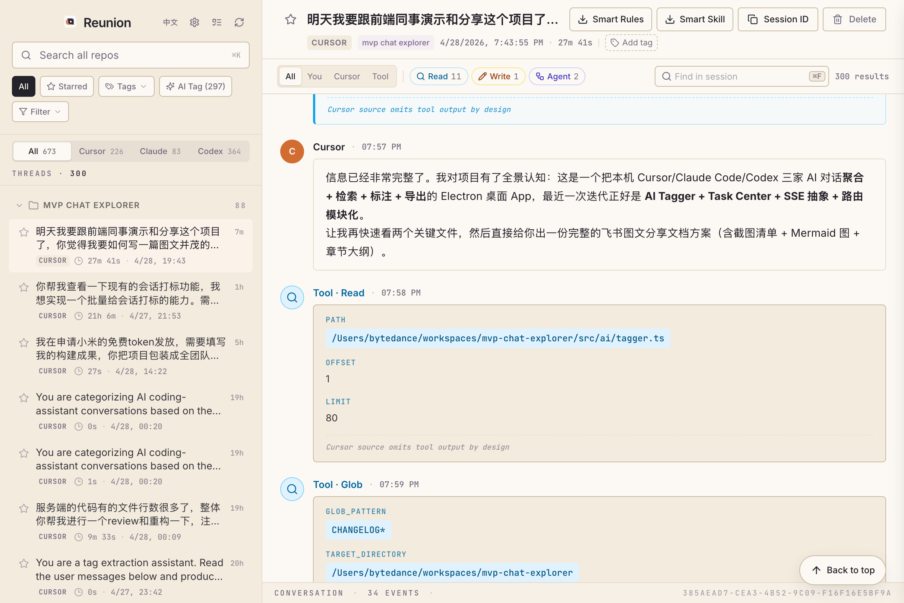

上图是 Claude Code 帮我"了解项目"过程中的真实片段：助手用 `Tool · Read` 调用 `tagger.ts`（OFFSET 1, LIMIT 80），又用 `Tool · Glob` 找 CHANGELOG。**所有工具调用都被结构化提取，比看原始日志清爽十倍**。

> [!IMPORTANT]
> 这个会话本身就是 Reunion 的"自我介绍"——是我在让 AI 帮我准备这份分享文档时的真实对话。Reunion 把它索引、展示、导出，就像它现在为你做的一样。

### 场景 C：AI 自动打标签 + 手动标注（**新功能**）

成百上千的会话靠人工分类不现实。Reunion 内置了一个 AI 批量打标签器：选定一批会话，AI 自动从每段对话的**用户消息**中提炼 1-3 个简短标签。

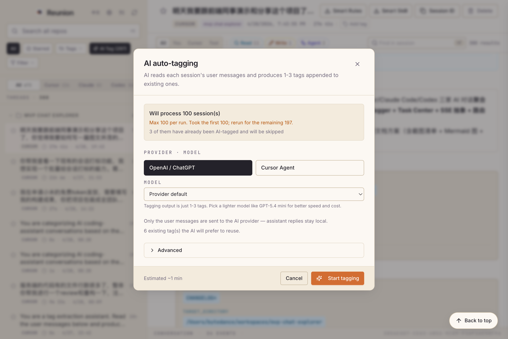

上图是 AI Tagger 配置面板：

- **批量处理**：单次最多 100 个会话，3 个已经打过的会跳过
- **Provider 二选一**：OpenAI ChatGPT 或 Cursor Agent
- **Model 可定制**：默认用 provider 的 default 模型
- **预估耗时**：~1 分钟（实际取决于会话长度和并发）

> [!CAUTION]
> **隐私底线**：只有用户消息会被发送给 AI provider，**助手回复永远留在本地**——你的代码、你的实验、你的内部讨论不会泄露。

打完标签后，会话头部就会出现 ✨ AI 标签，可点击 ✕ 移除：

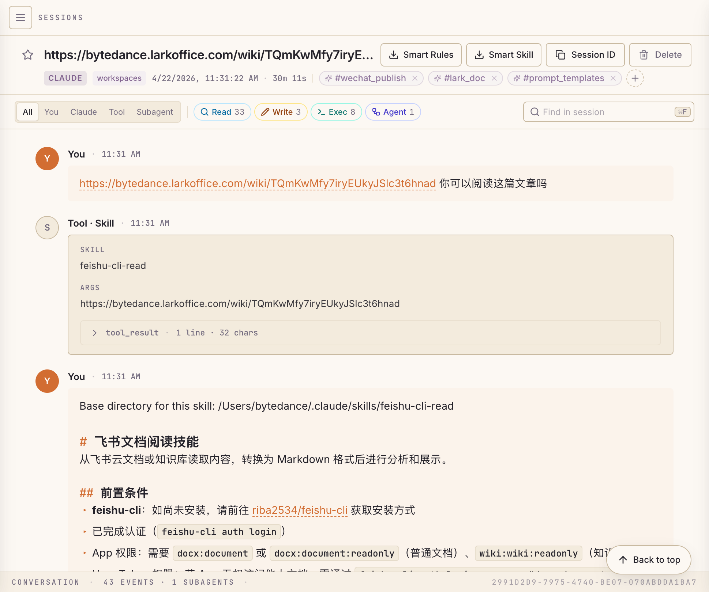

上图这个会话被自动打上了 `#wechat_publish`、`#lark_doc`、`#prompt_templates` 三个标签，准确反映了对话主题。还能看到工具桶（Read 33 / Write 3 / Exec 8 / Agent 1）和 subagent 计数（**1 SUBAGENTS**）——是的，subagent 也独立索引和展示。

### 场景 D：一键导出成 RULES.md / SKILL.md（**杀手锏**）

这是 Reunion 最有价值的一步：把对话**直接落到当前项目的 `.cursor/rules/*.mdc` 或 `.claude/skills/*/SKILL.md`**，下次新项目可以 cherry-pick 复用。

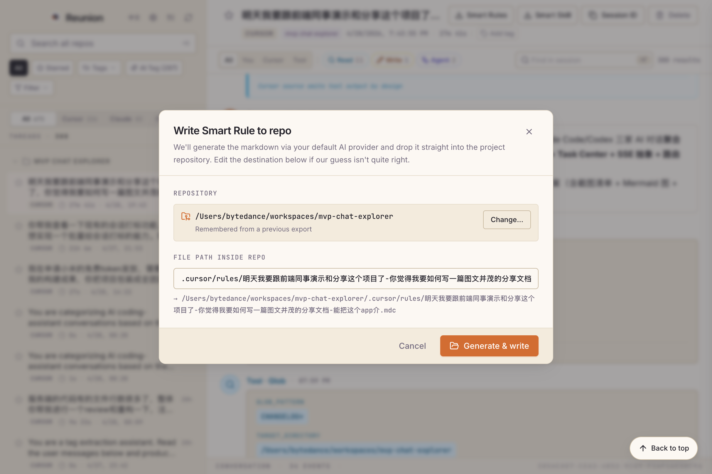

点击会话右上角的 **Smart Rules** 或 **Smart Skill** 按钮，弹出导出目标对话框：

- **Repository**：自动记住上次的目标仓库
- **File path inside repo**：自动按 Cursor / Claude 约定的路径填好
- **Generate & write**：交给 AI 生成结构化 markdown 并写入指定路径

任务交给后台跑，进度通过 SSE 实时推送到右侧任务中心：

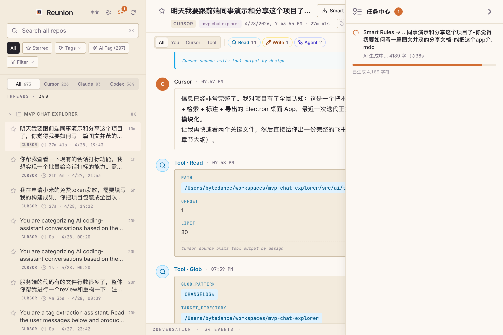

上图是 SSE 实时刷新的进度：**"AI 生成中… 4189 字 · 36s"** + 橙色进度条。

任务完成后，可以一键打开生成的文件：

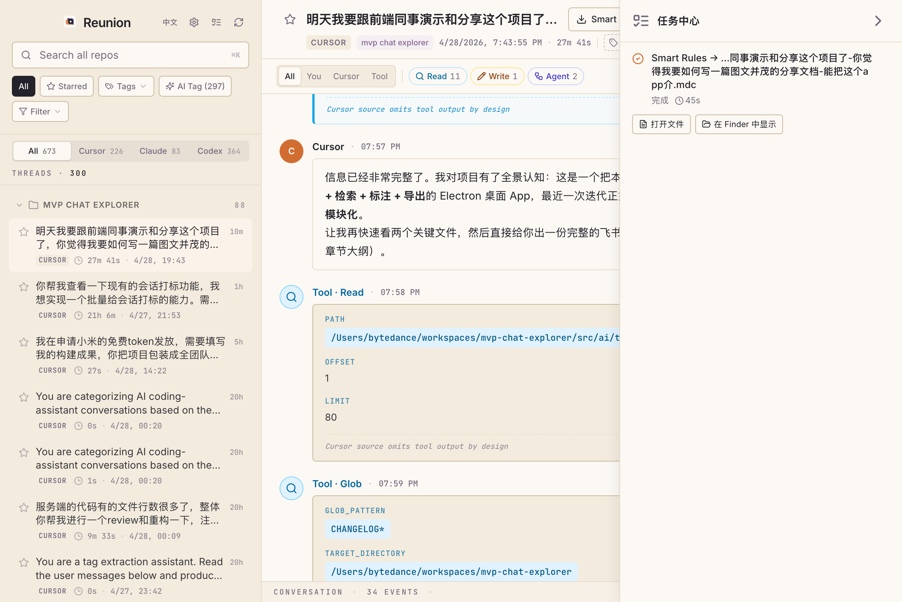

> [!SUCCESS]
> 一次完整生成耗时约 **45 秒**（取决于会话长度和模型），输出可直接被 Cursor / Claude Code 加载使用。

#### 真实生成示例

下面是 Reunion 刚才为本次"准备分享文档"对话生成的 `.mdc` 文件开头（节选）：

```markdown
# Reunion 飞书分享文档生成规则

## Metadata

- source_repo: `Users-bytedance-workspaces-mvp-chat-explorer`
- source_session_key: `cursor:Users-bytedance-workspaces-mvp-chat-explorer:385aead7-...`
- title: `明天我要跟前端同事演示和分享这个项目了，你觉得我要如何写一篇图文并茂的分享文档？...`
- updated: `2026-04-28`
- target_output: 飞书云文档链接
- language: 中文

## Objective

为 `Reunion` 项目生成一篇可直接用于向前端同事演示和分享的飞书图文文档。

文档需要满足以下目标：
- 面向前端同事，优先从潜在用户视角介绍 App
- 能够全面介绍 App 的定位、核心能力、使用流程、亮点功能和技术实现
- 作为演示后的沉淀资料，即使读者没有参加现场演示，也能独立读懂
- 最终产物不是本地 Markdown，而是可直接访问和展示的飞书云文档
- 文档中需要包含真实截图、结构化说明、Mermaid/画板、Callout 等适合飞书阅读的内容
```

---

## 三、AI Provider 配置

为了支持 Smart 导出和 AI Tagger，Reunion 内置了细致的 AI provider 管理：

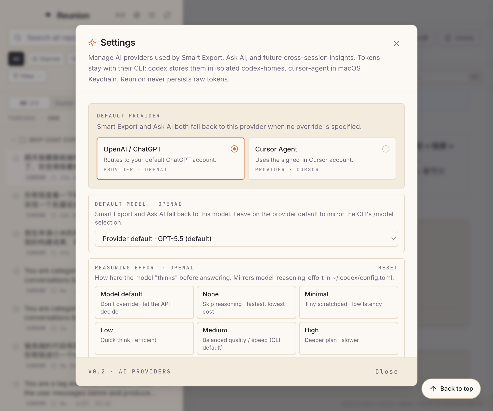

要点：

- **OpenAI / ChatGPT 多账号**：通过 OAuth 登录，每个账号独立隔离
- **Cursor Agent 单账号**：复用本机 `cursor-agent` CLI 的登录态
- **Model / Reasoning Effort / Service Tier** 都可细粒度配置
- 默认 provider 影响 Smart Export 和 AI Tagger 的路由

> [!IMPORTANT]
> **Reunion 永远不会持有 raw token**：
>
> - OpenAI 的 token 由 `codex` CLI 管理，存在隔离的 `~/Library/Application Support/Reunion/data/ai/codex-homes/<id>/auth.json`
> - Cursor 的 token 由 `cursor-agent` CLI 管理，存在 macOS Keychain
>
> Reunion 的 JSON 里只存账号 id / label / email，**指路而不持有**。

---

## 四、完整功能地图

| 模块 | 能力 |
|---|---|
| 数据源 | Cursor（含旧 .txt + 新 .jsonl）/ Claude Code / Codex CLI |
| 检索 | 全文 + 中英文 + 命中预览 + ⌘F 会话内查找 |
| 筛选 | 来源 Tab / repo / 时间窗口（7/30/60/90 天）/ ⭐ / 标签 |
| 标注 | ⭐ 星标 / 手动标签 / AI 自动打标 / 笔记 |
| 视图 | Conversation / Raw 双视图 / 角色筛选 / 工具桶筛选 |
| 导出 | Smart / Basic 模式 × Rules / Skill 类型 × 下载 / 写入仓库 |
| AI Provider | OpenAI ChatGPT 多账号（OAuth）+ Cursor Agent 单账号 |
| 任务中心 | 异步任务进度条 / SSE 实时推送 / 可中止 |
| 桌面化 | macOS DMG / 一行命令安装 / 自动过 Gatekeeper |

---

## 五、架构与技术亮点

### 整体架构

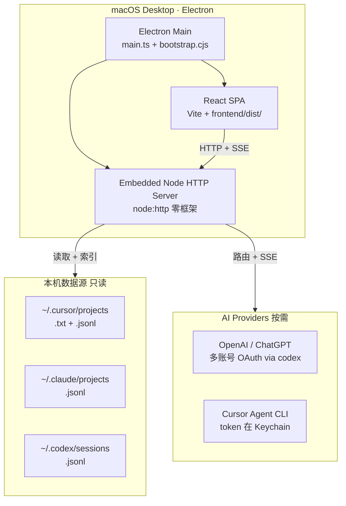

### 四个前端同事会感兴趣的技术决策

> [!TIP]
> **1. 三家 Agent 数据源抹平**
> Cursor / Claude / Codex 的 transcript 文件布局完全不同（旧 `.txt` 无时间戳、新 `.jsonl` 带 metadata、Codex 按 年/月/日 分目录），但内部统一到 `Session + segments + TimelineEvent`。Cursor 旧 `.txt` 还特意通过 `workspaceStorage` 的 generations 与用户句**对齐时钟**。

> [!TIP]
> **2. 多账号 OAuth：Reunion 不持有 token**
> 每个 OpenAI 账号一个独立 `CODEX_HOME` 目录，spawn `codex login` 让 codex 自己管 `auth.json`。这不只是省事——是 refresh token 单次使用语义下，多账号共用一个 home 会互相踩。Cursor 的 token 则全权交给 macOS Keychain。

> [!TIP]
> **3. SSE 抽象一套用四处**
> 后端薄封装 `src/lib/sse.ts`（`openSse / sendSse / abortSignalFromReq`），前端 `parseSseStream` 用 `getReader()` 解析。同一套模式复用在四个场景：**OAuth 登录、AI 流式输出、批量打标签、导出任务进度**。

> [!TIP]
> **4. Electron 打包踩过的真实坑**
>
> - `process.cwd()` 在打包后指向只读 `app.asar` → `bootstrap.cjs` 抢在 ESM main 加载前注入 `REUNION_DATA_DIR`
> - `spawn('cursor-agent')` 找不到命令 → `fix-path` 修 PATH
> - Apple Silicon 拒签 ad-hoc → `after-pack.cjs` 对整个 `.app` 做 deep 重签
> - universal merge 不稳 → 改成 arm64 + x64 分别打两个 DMG
> - esbuild 双产出：Electron main 走 ESM，CLI server 走 CJS

### SSE 工作流程

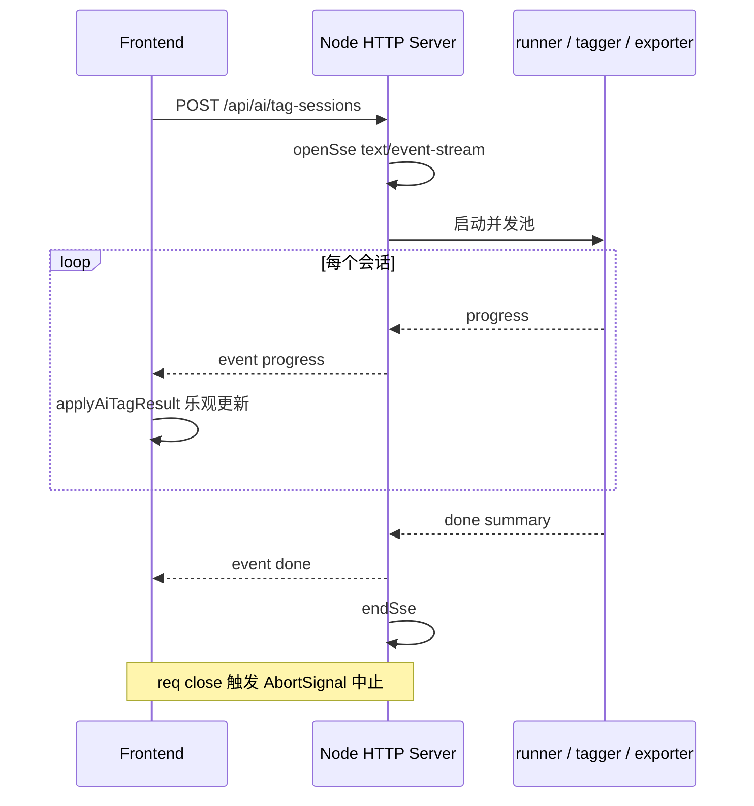

---

## 六、安装与上手

同事拿到 Mac 直接跑：

```bash
curl -fsSL https://github.com/MeCKodo/reunion/releases/latest/download/install.sh | bash
```

会自动：

- 下载对应架构 DMG（arm64 / x64 双版本）
- 装到 `/Applications/Reunion.app`
- `xattr -cr` 清 quarantine，**不会遇到 Gatekeeper 弹窗**

首次打开如有问题，参考 [`FIRST_OPEN.md`](https://github.com/MeCKodo/reunion/blob/main/FIRST_OPEN.md)。

---

## 七、Roadmap

Reunion 接下来分两条线：

> [!NOTE]
> **个人版（当前主线）**
> 继续打磨本机会话聚合、检索、导出体验，叠加 AI 能力（多账号 OAuth、Cursor Agent 集成、AI Tagger）做对话级深度分析。最近几个版本的重点：AI Tagger、Task Center、SSE 抽象、路由模块化。

> [!NOTE]
> **团队版（规划中）**
> 在征得团队成员同意的前提下，把团队对话聚合到统一视图，围绕"团队会话资产"做演化分析、最佳实践沉淀、新人 onboarding 等上层能力。**作为独立分支存在，不会改变个人版的数据流向**。

---

## 八、反馈渠道

- **GitHub**：[MeCKodo/reunion](https://github.com/MeCKodo/reunion)
- **当前版本**：v0.2.1
- **Repo 内 docs**：[`README.md`](https://github.com/MeCKodo/reunion/blob/main/README.md) · [`AGENTS.md`](https://github.com/MeCKodo/reunion/blob/main/AGENTS.md) · [`CHANGELOG.md`](https://github.com/MeCKodo/reunion/blob/main/CHANGELOG.md)

欢迎试用、反馈、贡献。如果你的 AI 对话也散落在三个 CLI 的角落，Reunion 应该能帮到你。
